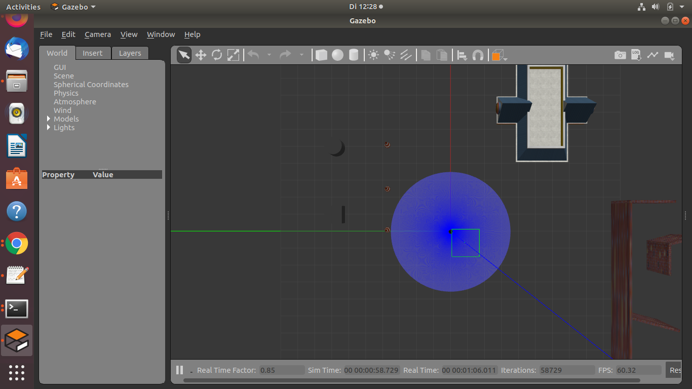

# Robot navigation to given goal points

This my first ROS project in which we have to reach the goals points published in `/goals` topic by launching the goal_publisher launch file.
Now you may ask whats the big deal to reach the goal points. Here comes the main task!! We have to reach the goals avoiding the obsticals which we come accross. Brief structure of the Mini Project

This is my first ROS Project, here the robot should navigate to all the given goals on the x-y plane. If there is an obstacle encountered when the robot is moving towards a goal it has to avoid the obstacle and move towards the goal. Here the robot will reach all the given 20 goal points.

[[_TOC_]]

## Requirements
- ROS installed on ubuntu
- Gazebo installed on ubuntu
- python

## Getting started

First we have to launch empty world from turtlebot_gazebo package. To load the predesigned test arena we have to run the following command.

`rosrun gazebo_ros spawn_model -file ~/catkin_ws/src/mb-192233_tier3_miniprj/mini_project_master/model.sdf -sdf -x 2 -y 1 -model mini_project.` 

Gazebo simulation should now look like the screenshot below.



Now we are ready for Robot navigation.


## Description

create a package that, when launched, will navigate the turtlebot to goals positions as many as possible that are published on a topic called /goals.

Sr.No| List of Topics       | Subscribed/Published      | Message type    | Message imported from package    | 
:---: | :---         	    | :---                      | :---            | :--- 	                         | 
1    | /goals       	    | Subscribed                | PointArray      | goal-publisher                   |
2    | /gazebo/model_states | Subscribed                | ModelStates     | gazebo-msgs                      |
3    | /scan                | Subscribed                | LaserScan       | sensor-msgs
4    | /cmd_vel             | Published                 | Twist           | geometry-msgs                    |

1. `/goals` topic is subscribed to get the goal points which is published when we launch goal_publisher package.

2. `/gazebo/model_states` topic is subscribed to obtain the position and orientation of the turtlebot in the given environment. The message of this topic contains the details of position and orientation of the 'ground-plane', 'turtlebot3-burger' and 'mini-project'. But we are intrested in the details of turtlebot alone.

3. `/scan` topic is subscribed to get the details of the objects surrounding turtlebot.

4. Depending on the situation appropriate speed is published to the turtlebot using the topic `/cmd_vel`.


## Algorithm

After launching goal-publisher and the gazebo simulation.

- Subscribe to the /goals, /gazebo/model_states and /scan topic so that we get the goals, position & orientation of the turtlebot and laser scan data respectively.
#logic
  - If goal count is less than total goals(20)
    - move the robot
      - Start Turning towards goal point untill the turtlebot angle and goal point angle becomes less than 5 degree.
      - When the turtlebot angle and goal point angle becomes less than 5 degree, start moving forward towards the goal.
      - check for obstacle
        - if there is an obstacle turn right 90 degrees and move forward for a arbitrary distance.   
      - When the distance between robot and goal is less than 0.1 stop and start turning to the next goal.
  - Repete this steps untill all the goals are reached.


## Implementation

Firstly I have initializing all the variables to get goals, position & orientation of the turtlebot and the laser scan data.
And then defined three call back functions and few user defined functions.

**Call_back functions** 
- To get the all the goals and also do the sorting.
- To get the position of the turtlebot which can be used as and when it is needed.
- To get the laserscan data and setting the range for front, right and left variables.

**User defined functions**
- To calculate the distance(EU_distance) from the turtlebot to the goal.
```python
distance = math.sqrt((x1-x)**2 + (y1-y)**2) # (x1,y1) is goal point and (x,y) is the position of the turtlebot
```
- To determine angle(cal_angle_for_goals) to the goal with respect to turtlebot. This is used to check whether the turtlebot is facing towards goal, to convert angle to (0-360) and to change the rotation of the turtlebot
```python
def cal_angle_for_goals(i):
        inc_x[i] = goal[i].x - x
        inc_y[i] = goal[i].y - y
        angle_goal = math.atan2(inc_y[i], inc_x[i])
        if angle_goal < 0:
           angle_goal = 2*math.pi - abs(angle_goal) #convert to (0-360)
        if math.degrees(angle_goal) - math.degrees(z) < 0:
           sign = -1
        else:
           sign = 1
        return math.degrees(angle_goal)
```

## Problems and solutions

**Problem:**

By default the robot was moving towards left which took a lot of time to rotate if the goal angle was less than robot angle now now to rotate the bot clockwise or anticlockwise??

And sometimes because of the inertia the robot would rotate more tha required and should go around another round to come back to the goal angle direction

**Solution:**

Angle to goal - determines which quadrant the goal is with respect to turtlebot.
Angle - Angle where the turtlebot is facing.

If the goal is left to the turtlebot (Angle to goal - Angle) is positive in all the cases and If the goal is towards the right of the turtlebot (Angle to goal - Angle) is negative, taking the sign of (Angle to goal - Angle) and passing this to z value of the /cmd_vel tp publish to robot, it would move considering the signs of the angles. this logic saves a lot of time for the robot. 

We can deside our turtlebot to rotate anticlockwise or clockwise based on this positive or negative sign.
